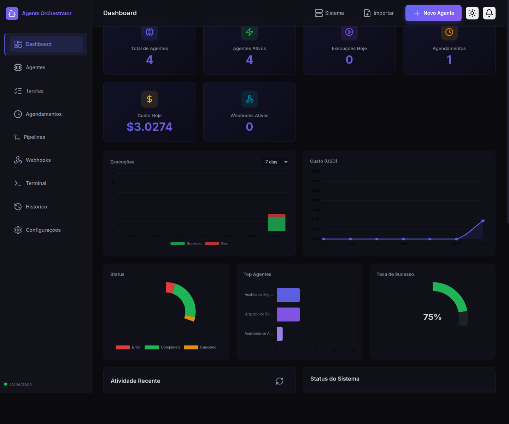

# Agents Orchestrator

Painel administrativo web para orquestração de agentes [Claude Code](https://docs.anthropic.com/en/docs/claude-code). Crie, configure e execute múltiplos agentes com diferentes personalidades, modelos e diretórios de trabalho — tudo a partir de uma interface visual profissional.



## Acesso

| Recurso | URL |
|---------|-----|
| **Aplicação** | https://agents.nitro-cloud.duckdns.org |
| **Repositório** | https://git.nitro-cloud.duckdns.org/fred/agents-orchestrator |
| **Portal Nitro Cloud** | https://nitro-cloud.duckdns.org |

## Funcionalidades

### Gerenciamento de Agentes
- Crie agentes com nome, system prompt, modelo (Sonnet/Opus/Haiku), diretório de trabalho, ferramentas permitidas, modo de permissão e tags
- Ative, desative, edite, **duplique** ou exclua a qualquer momento
- Exporte/importe configurações completas em JSON

### Catálogo de Tarefas
- Crie e gerencie tarefas reutilizáveis com nome, categoria e descrição detalhada
- Categorias: Code Review, Segurança, Refatoração, Testes, Documentação, Performance
- Filtro por texto e categoria
- Execute qualquer tarefa diretamente no agente escolhido
- Cards com truncamento inteligente e tooltip com descrição completa

### Execução de Tarefas
- Execute tarefas sob demanda em qualquer agente ativo
- Templates rápidos incluídos (detecção de bugs, revisão OWASP, refatoração, testes, documentação, performance)
- **Reexecute** tarefas que falharam ou foram canceladas com um clique
- Continuação de conversa (resume session) no terminal

### Terminal em Tempo Real
- Streaming chunk-a-chunk via WebSocket com indicador de conexão
- **Botão Interromper** para cancelar todas as execuções ativas
- **Busca** no output do terminal com navegação entre ocorrências
- **Download** da saída completa como `.txt`
- **Copiar** saída para a área de transferência
- **Toggle de auto-scroll** para controle manual da rolagem
- Filtro por execução

### Dashboard com Gráficos
- Métricas em tempo real (agentes, execuções, agendamentos, custo, webhooks)
- **Gráfico de execuções** por dia (barras empilhadas sucesso/erro)
- **Gráfico de custo** por dia (linha com área preenchida)
- **Distribuição de status** (doughnut chart)
- **Top 5 agentes** mais executados (barras horizontais)
- **Taxa de sucesso** geral (gauge com percentual)
- Seletor de período: 7, 14 ou 30 dias

### Agendamento Cron
- Agende tarefas recorrentes com expressões cron
- Presets incluídos (horário, diário, semanal, mensal)
- Histórico de execuções por agendamento com duração e custo

### Pipelines
- Encadeie múltiplos agentes em fluxos sequenciais
- Saída de cada passo alimenta o próximo via template `{{input}}`
- **Diretório de trabalho** configurável por pipeline (pré-preenchido com base path)
- Portões de aprovação humana entre passos (human-in-the-loop)
- **Retomar pipelines falhas** a partir do passo onde pararam
- Ideal para fluxos como "analisar → corrigir → testar"

### Webhooks
- Dispare execuções de agentes ou pipelines via HTTP externo
- **Edite** webhooks existentes (nome, alvo, status)
- **Teste** webhooks com um clique para verificar configuração
- Snippet cURL pronto para copiar
- Assinatura HMAC-SHA256 para validação de origem

### Notificações
- **Centro de notificações** no header com badge de contagem
- Notificações automáticas para execuções concluídas e com erro
- **Notificações nativas do navegador** (Browser Notification API)
- Marcar como lidas / limpar todas
- Polling automático a cada 15 segundos

### Tema Claro/Escuro
- Toggle de tema no header com transições suaves
- Persistência da preferência em localStorage
- Terminal mantém fundo escuro em ambos os temas

### Exportação de Dados
- **Exportar histórico** de execuções como CSV (UTF-8 com BOM)
- Exportar configuração de agentes em JSON

### Atalhos de Teclado
| Tecla | Ação |
|-------|------|
| `1`–`9` | Navegar entre seções |
| `N` | Novo agente |
| `Esc` | Fechar modal |

## Deploy

A aplicação roda em container Docker na infraestrutura Nitro Cloud com HTTPS automático via Caddy + Let's Encrypt.

### Deploy automático (recomendado)

Um único comando faz push e deploy completo:

```bash
git deploy
```

O script `scripts/deploy.sh` executa automaticamente:

1. Push para GitHub (origin) e Gitea (nitro)
2. Backup dos dados no VPS (`data-backup-YYYYMMDD-HHMMSS`)
3. Sincronização via rsync (exclui `data/`, `.git`, `node_modules`)
4. Correção de permissões do diretório de dados
5. Rebuild do container Docker
6. Verificação do container e integridade dos dados
7. Limpeza de backups antigos (mantém os 3 mais recentes)

Opções:

```bash
git deploy                  # Push + deploy completo
bash scripts/deploy.sh --skip-push   # Apenas deploy, sem push
```

## Variáveis de Ambiente

| Variável | Descrição | Padrão |
|----------|-----------|--------|
| `PORT` | Porta do servidor | `3000` |
| `HOST` | Endereço de bind | `0.0.0.0` |
| `AUTH_TOKEN` | Token Bearer para autenticação da API | _(desabilitado)_ |
| `ALLOWED_ORIGIN` | Origin permitida para CORS | `https://agents.nitro-cloud.duckdns.org` |
| `ALLOWED_DIRECTORIES` | Diretórios permitidos para working directory (CSV) | _(todos)_ |
| `WEBHOOK_SECRET` | Segredo HMAC para assinatura de webhooks | _(desabilitado)_ |
| `CLAUDE_BIN` | Caminho para o binário do Claude CLI | _(auto-detectado)_ |
| `REDIS_URL` | URL do Redis para cache L2 (opcional) | _(somente memória)_ |

## Como Funciona

### Criando um agente

1. Acesse https://agents.nitro-cloud.duckdns.org
2. Clique em **Novo Agente** no header ou na seção Agentes
3. Configure nome, system prompt, modelo e diretório de trabalho
4. Salve — o agente aparecerá como card na listagem

### Executando uma tarefa

1. No card do agente, clique em **Executar**
2. Descreva a tarefa ou use um template rápido
3. Opcionalmente adicione instruções extras
4. A execução inicia e o terminal abre automaticamente com streaming da saída

### Criando um pipeline

1. Vá em **Pipelines** → **Novo Pipeline**
2. Adicione pelo menos 2 passos, selecionando um agente para cada
3. Opcionalmente defina um template de input usando `{{input}}` para referenciar a saída do passo anterior
4. Marque passos que requerem aprovação humana antes de prosseguir
5. Execute o pipeline fornecendo o input inicial

### Agendando uma tarefa

1. Vá em **Agendamentos** → **Novo Agendamento**
2. Selecione o agente, descreva a tarefa e defina a expressão cron
3. A tarefa será executada automaticamente nos horários configurados

## Infraestrutura

```
Cliente (navegador)
    │
    ▼ HTTPS (porta 443)
  Caddy (reverse proxy + SSL automático)
    │
    ▼ agents.nitro-cloud.duckdns.org
  Container Docker (agents-orchestrator)
    │
    ├── Express (HTTP API + arquivos estáticos)
    └── WebSocket (streaming em tempo real)
```

### Arquitetura Interna

```
server.js                     Express + WebSocket + rate limiting + auth
src/
  routes/api.js               API REST (/api/*) — 30+ endpoints
  agents/
    manager.js                CRUD + orquestração + notificações
    executor.js               Spawna o CLI claude como child_process
    scheduler.js              Agendamento cron (in-memory + persistido)
    pipeline.js               Execução sequencial com aprovação humana
  store/db.js                 Persistência em JSON com escrita atômica
  cache/index.js              Cache em 2 níveis (memória + Redis opcional)
public/
  index.html                  SPA single-page com hash routing
  css/styles.css              Design system (dark/light themes)
  js/
    app.js                    Controlador principal + WebSocket + tema + routing
    api.js                    Client HTTP para a API
    components/               UI por seção (15 módulos)
data/
  agents.json                 Agentes cadastrados
  tasks.json                  Templates de tarefas
  pipelines.json              Pipelines configurados
  schedules.json              Agendamentos persistidos
  executions.json             Histórico de execuções (max 5000)
  webhooks.json               Configuração de webhooks
  notifications.json          Notificações do sistema
  settings.json               Configurações globais
```

O executor invoca o binário `claude` com `--output-format stream-json`, parseia o stdout linha a linha e transmite os chunks via WebSocket para o frontend em tempo real.

## API REST

### Agentes

| Método | Endpoint | Descrição |
|--------|----------|-----------|
| `GET` | `/api/agents` | Listar agentes |
| `POST` | `/api/agents` | Criar agente |
| `GET` | `/api/agents/:id` | Obter agente |
| `PUT` | `/api/agents/:id` | Atualizar agente |
| `DELETE` | `/api/agents/:id` | Excluir agente |
| `POST` | `/api/agents/:id/execute` | Executar tarefa no agente |
| `POST` | `/api/agents/:id/continue` | Continuar conversa (resume) |
| `POST` | `/api/agents/:id/cancel/:execId` | Cancelar execução |
| `GET` | `/api/agents/:id/export` | Exportar agente (JSON) |
| `POST` | `/api/agents/:id/duplicate` | Duplicar agente |

### Tarefas

| Método | Endpoint | Descrição |
|--------|----------|-----------|
| `GET` | `/api/tasks` | Listar tarefas |
| `POST` | `/api/tasks` | Criar tarefa |
| `PUT` | `/api/tasks/:id` | Atualizar tarefa |
| `DELETE` | `/api/tasks/:id` | Excluir tarefa |

### Agendamentos

| Método | Endpoint | Descrição |
|--------|----------|-----------|
| `GET` | `/api/schedules` | Listar agendamentos |
| `POST` | `/api/schedules` | Criar agendamento |
| `PUT` | `/api/schedules/:taskId` | Atualizar agendamento |
| `DELETE` | `/api/schedules/:taskId` | Remover agendamento |
| `GET` | `/api/schedules/history` | Histórico de execuções agendadas |

### Pipelines

| Método | Endpoint | Descrição |
|--------|----------|-----------|
| `GET` | `/api/pipelines` | Listar pipelines |
| `POST` | `/api/pipelines` | Criar pipeline |
| `GET` | `/api/pipelines/:id` | Obter pipeline |
| `PUT` | `/api/pipelines/:id` | Atualizar pipeline |
| `DELETE` | `/api/pipelines/:id` | Excluir pipeline |
| `POST` | `/api/pipelines/:id/execute` | Executar pipeline |
| `POST` | `/api/pipelines/:id/cancel` | Cancelar pipeline |
| `POST` | `/api/pipelines/:id/approve` | Aprovar passo pendente |
| `POST` | `/api/pipelines/:id/reject` | Rejeitar passo pendente |
| `POST` | `/api/pipelines/resume/:execId` | Retomar pipeline falha |

### Webhooks

| Método | Endpoint | Descrição |
|--------|----------|-----------|
| `GET` | `/api/webhooks` | Listar webhooks |
| `POST` | `/api/webhooks` | Criar webhook |
| `PUT` | `/api/webhooks/:id` | Atualizar webhook |
| `DELETE` | `/api/webhooks/:id` | Excluir webhook |
| `POST` | `/api/webhooks/:id/test` | Testar webhook |

### Execuções e Histórico

| Método | Endpoint | Descrição |
|--------|----------|-----------|
| `GET` | `/api/executions/active` | Execuções em andamento |
| `GET` | `/api/executions/history` | Histórico paginado com filtros |
| `GET` | `/api/executions/recent` | Execuções recentes |
| `GET` | `/api/executions/export` | Exportar histórico como CSV |
| `GET` | `/api/executions/:id` | Detalhes de uma execução |
| `DELETE` | `/api/executions/:id` | Excluir execução do histórico |
| `POST` | `/api/executions/:id/retry` | Reexecutar execução falha |
| `POST` | `/api/executions/cancel-all` | Cancelar todas as execuções ativas |
| `DELETE` | `/api/executions` | Limpar histórico |

### Notificações

| Método | Endpoint | Descrição |
|--------|----------|-----------|
| `GET` | `/api/notifications` | Listar notificações |
| `POST` | `/api/notifications/:id/read` | Marcar como lida |
| `POST` | `/api/notifications/read-all` | Marcar todas como lidas |
| `DELETE` | `/api/notifications` | Limpar notificações |

### Sistema

| Método | Endpoint | Descrição |
|--------|----------|-----------|
| `GET` | `/api/health` | Health check (sem auth) |
| `GET` | `/api/system/status` | Status geral do sistema |
| `GET` | `/api/system/info` | Informações do servidor |
| `GET` | `/api/stats/costs` | Estatísticas de custo |
| `GET` | `/api/stats/charts` | Dados para gráficos do dashboard |
| `GET/PUT` | `/api/settings` | Configurações globais |

## Eventos WebSocket

O servidor envia eventos tipados via WebSocket que o frontend renderiza no terminal:

| Evento | Descrição |
|--------|-----------|
| `execution_output` | Chunk de texto da saída do agente |
| `execution_complete` | Execução finalizada com resultado |
| `execution_error` | Erro durante execução |
| `pipeline_step_start` | Início de um passo do pipeline |
| `pipeline_step_complete` | Passo do pipeline concluído |
| `pipeline_complete` | Pipeline finalizado |
| `pipeline_error` | Erro em um passo do pipeline |
| `pipeline_approval_required` | Passo aguardando aprovação humana |

## Segurança

- **HTTPS** via Caddy com certificado Let's Encrypt automático
- **Autenticação** via Bearer token (variável `AUTH_TOKEN`)
- **Rate limiting** — 100 requisições por minuto por IP
- **CORS** restrito à origin configurada
- **Timing-safe comparison** para tokens de autenticação e webhooks
- **Correlation IDs** em todas as requisições para rastreabilidade
- **Escrita atômica** em disco (temp + rename) para integridade de dados
- **Sanitização** de prompts (NUL, caracteres de controle, limite de 50.000 chars)
- **Assinatura HMAC-SHA256** para webhooks recebidos

## Stack

- **Backend**: Node.js, Express, WebSocket (ws), node-cron, uuid, express-rate-limit
- **Frontend**: HTML, CSS, JavaScript vanilla (sem framework, sem bundler)
- **Gráficos**: Chart.js 4.x
- **Ícones**: Lucide
- **Fontes**: Inter (UI), JetBrains Mono (código/terminal)
- **Persistência**: Arquivos JSON em disco com escrita atômica
- **Cache**: In-memory com suporte opcional a Redis (ioredis)
- **Infraestrutura**: Docker + Caddy + DuckDNS + Let's Encrypt

## Licença

MIT
